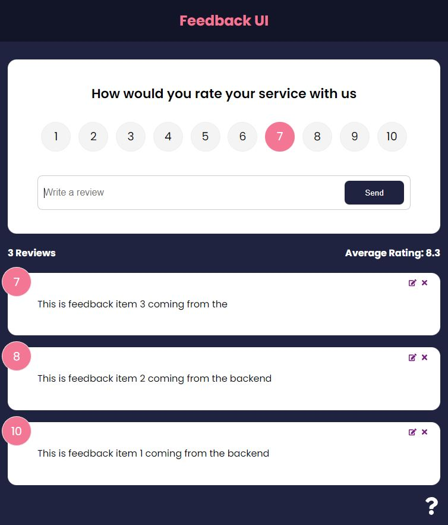

# Feedback App

A project created to learn the basics of the React framework </br>
It allows users to add, update and delete feedback. It uses a mock REST api with json-server.

This project goes over all of the fundamentals of React including...

<ul>
<li>Components</li>
<li>JSX</li>
<li>Props (proptypes, defaultprops, etc)</li>
<li>State (Component & App Level)</li>
<li>Styling</li>
<li>Handling Events</li>
<li>Lists & Keys</li>
<li>Forms</li>
<li>Context API</li>
<li>HTTP Requests</li>
 </ul>

<p align="center">
  
</p>

# Usage

### Install dependencies

```bash
npm install
```

### Run

```bash
npm run dev
```

This will run JSON-server on port :5000 and React on port :3000

# Credits

https://www.udemy.com/course/react-front-to-back-2022/ </br>
Brad Traversy - React Front To Back 2022 
